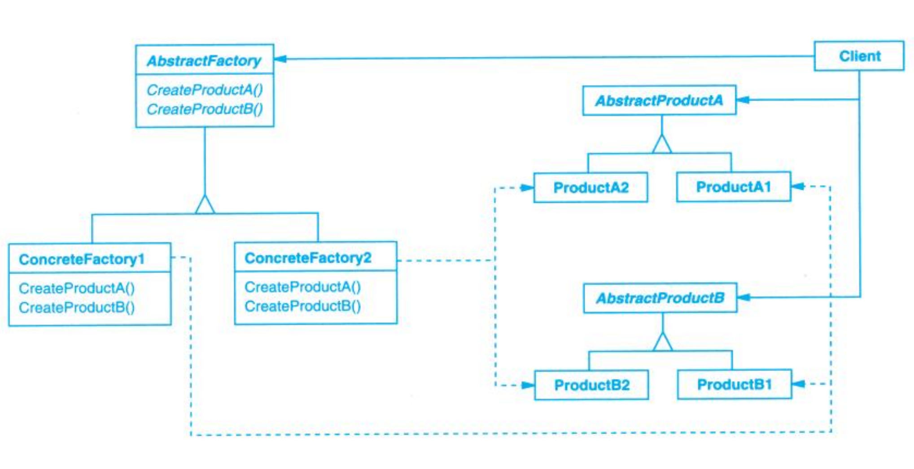

# 1、意图

在系统初始化阶段，选择一个“平台实现”， 之后系统中所有相关模块都必须从这个平台创建，且彼此匹配。

注意三点：

1. **一系列对象（不是一个）**
2. **相关 / 依赖（必须能一起工作）**
3. **选择发生在“创建阶段”，不是使用阶段**

# 2、动机

## 2.1 原意

在 GoF 写书的年代（1995）：

*`GoF是“四人组”（Gang of Four）的英文缩写，指代软件工程著作《Design Patterns: Elements of Reusable Object-Oriented Software》的四位作者埃里希·伽玛（Erich Gamma）、理查德·海尔姆（Richard Helm）、拉尔夫·约翰逊（Ralph Johnson）和约翰·弗利赛迪斯（John Vlissides）。`*

- Windows / Motif / MacOS UI
- **控件长得不一样**
- 但“按钮 / 滚动条 / 窗口”这些概念是一样的
- 用户代码希望 **一次切换平台，整体换外观**

GUI 是一个**极佳的“产品族”例子**：

```
Windows 风格
 ├─ Button
 ├─ Scrollbar
 └─ Menu

Motif 风格
 ├─ Button
 ├─ Scrollbar
 └─ Menu
```

如何保证 Button / Scrollbar / Menu 来自同一个 UI 风格？

## 2.2 嵌入式适配

不是 RTOS，也不是驱动函数，而是：

> **平台 / 芯片 / BSP**

因为它们同样具备三个特征：

1. 提供一组功能等价的接口
2. 实现细节强相关
3. 必须整体切换

| GoF GUI    | 嵌入式等价      |
| ---------- | --------------- |
| Button     | UART            |
| Scrollbar  | GPIO            |
| Menu       | SPI             |
| UI Toolkit | MCU / SoC / BSP |


你觉得抽象工厂是怎么做的？stm32hal库？


### Step 1：系统要支持多个平台

例如：

- STM32Fx
- GD32?

**业务逻辑完全一样：**

```
log_print("hello");
led_on();
```

------

### Step 2：所谓的实现？

```
#ifdef STM32Fx
    stm32_uart_send(...);
    stm32_gpio_set(...);
#elif defined GD32
    gd32_uart_send(...);
    gd32_gpio_set(...);
#endif
```

GoF 在 GUI 里用的是：

```
if (windows)
    new WinButton;
else
    new MotifButton;
```

### Step 3：问题暴露

1. **平台判断扩散到业务层**
    业务代码本应只关心“发日志”“点灯”，却被迫知道当前是 STM32 还是 GD32。
    平台选择不再是架构决策，而是被拆散成大量 `#ifdef`。
2. **无法保证“产品族一致性”**
    编译层面允许：
   - STM32 的 UART
   - GD32 的 GPIO
      同时存在于同一系统中，但这种组合在语义上是错误的。
3. **平台切换成本极高**
    新增或替换一个平台：
   - 需要修改大量业务文件
   - 风险随代码规模线性上升
4. **创建逻辑与使用逻辑强耦合**
    业务代码在“使用外设”的同时，还承担了“选择外设实现”的职责，
    这正是 GoF 在 GUI 场景中明确反对的设计。
5. **系统初始化阶段缺乏统一的“平台绑定点”**
    平台选择是零散发生的，而不是在系统启动时一次性确定，
    导致系统整体架构不稳定、不可控。

# 3、适用性

### 1. 系统需要支持多个平台或芯片系列

- 同一套业务逻辑需要运行在不同 MCU / SoC 上  
- 例如：STM32、GD32、NXP、国产替代芯片
- 平台差异主要集中在外设实现层

**典型特征**：  
平台可切换，但业务不可改。

---

### 2. 系统中存在“必须成组使用”的外设或模块

- UART / GPIO / SPI / I2C 等外设之间存在隐性耦合
- 时钟树、DMA、中断模型通常是平台级统一设计
- 混用不同 BSP 的外设实现在语义上是错误的

**抽象工厂的价值**：  
保证外设对象始终来自同一平台族。

---

### 3. 平台选择发生在系统初始化阶段

- 平台在上电或启动阶段即可确定
- 运行期不需要、也不允许动态切换平台
- 非运行期策略选择，而是系统架构决策

**这与 GoF“创建阶段选择实现”的假设完全一致。**

---

### 4. 业务代码需要与平台实现彻底解耦

- 业务逻辑只关心“能力”，不关心“实现”
- 禁止在业务层出现 `#ifdef MCU_xxx`
- 便于代码复用、单元测试、仿真与移植

---

### 5. 不适用的情况（嵌入式中常见误用）

- 仅支持单一平台，且长期不考虑移植
- 外设数量极少，平台差异可以忽略
- 对代码体量、抽象层次极度敏感的极小系统

**此时引入抽象工厂只会增加复杂度。

# 4 、结构




**Client 需要能力**

Client 只知道 AbstractFactory

AbstractFactory 声明能创建哪些 AbstractProduct

ConcreteFactory 决定用哪套 ConcreteProduct

ConcreteProduct 实现真正的平台细节


# 5、 参与者（Participants）——嵌入式视角

### 1. AbstractFactory（抽象工厂）

**角色含义**：  
定义平台能够创建的一组外设或系统能力的接口。

**嵌入式等价**：  
`PlatformFactory / BSPFactory`

**职责**：

- 声明可创建的外设能力（UART / GPIO / SPI 等）
- 不包含任何平台或芯片相关信息
- 作为业务层唯一可见的“平台入口”

---

### 2. ConcreteFactory（具体工厂）

**角色含义**：  
实现 AbstractFactory，绑定到某一个具体平台。

**嵌入式等价**：

- `STM32Factory`
- `GD32Factory`
- `NXPFactory`

**职责**：

- 在系统初始化阶段被选中
- 负责创建该平台下的所有外设实现
- 保证生成的外设对象来自同一 BSP / 芯片族

---

### 3. AbstractProduct（抽象产品）

**角色含义**：  
定义某一类对象的公共接口。

**嵌入式等价**：

- `UART`
- `GPIO`
- `SPI`

**职责**：

- 描述“能力”，而不是“实现”
- 不依赖寄存器、HAL 或具体外设型号
- 作为业务层操作外设的唯一接口

---

### 4. ConcreteProduct（具体产品）

**角色含义**：  
实现 AbstractProduct，对应具体平台下的实现。

**嵌入式等价**：

- `STM32_UART`
- `GD32_UART`
- `STM32_GPIO`

**职责**：

- 封装寄存器访问、HAL 调用、中断与 DMA 细节
- 仅由对应的 ConcreteFactory 创建
- 不应被业务代码直接引用

---

### 5. Client（客户端）

**角色含义**：  
使用抽象工厂和抽象产品的代码。

**嵌入式等价**：  
业务逻辑 / 应用层 / 控制逻辑

**职责**：

- 仅依赖 AbstractFactory 和 AbstractProduct
- 不关心具体平台实现
- 不参与平台选择，也不参与外设创建策略

---

# 6、 协作（Collaborations）——嵌入式视角

1. **系统启动阶段选择 ConcreteFactory**  
   - 根据编译选项或启动配置确定具体平台  
   - 该选择只发生一次

2. **Client 持有 AbstractFactory 接口**  
   - 业务代码仅知道“平台工厂”，不知道具体平台
   - 不直接创建任何外设对象

3. **AbstractFactory 负责创建 AbstractProduct**  
   - Client 通过工厂接口获取 UART / GPIO / SPI 等能力
   - 不关心具体实现来源

4. **ConcreteFactory 实例化 ConcreteProduct**  
   - 每个 ConcreteFactory 只创建自身平台对应的外设实现
   - 保证外设对象来自同一 BSP / 芯片族

5. **Client 通过 AbstractProduct 使用外设能力**  
   - 业务代码只调用抽象接口
   - 不参与平台判断，也不感知平台差异

# 7、 效果（Consequences）——嵌入式视角

- **强制平台一致性**  
  外设对象成族创建，避免混用不同 BSP / 芯片实现。

- **业务层与平台解耦**  
  业务代码只依赖能力接口，不再感知 MCU 或 HAL。

- **平台切换成本可控**  
  新增或替换平台，修改范围集中在工厂实现。

- **结构清晰，架构边界明确**  
  平台选择成为初始化阶段的显式决策，而非隐性 `#ifdef`。

---

- **抽象层增加**  
  代码量与接口数量上升，不适合极小系统。

- **平台扩展需要成体系实现**  
  新平台必须完整实现一组外设能力，而不能零散接入。

- **运行期灵活性有限**  
  设计目标是“初始化期绑定”，不支持运行期平台切换。


# 8、已知应用


| 平台类别        | 具体品牌/库             | 平台工厂（AbstractFactory / ConcreteFactory）                | 外设能力（AbstractProduct）   | 具体实现（ConcreteProduct）     |
| --------------- | ----------------------- | ------------------------------------------------------------ | ----------------------------- | ------------------------------- |
| MCU / 单片机    | STM32 / GD32 / NXP / TI | BSPFactory / PlatformFactory → STM32Factory / GD32Factory / iMXRTFactory / TivaFactory | UART / GPIO / SPI / I2C / PWM | HAL / DriverLib 等 MCU 具体驱动 |
| Linux / SoC     | x86 / ARM / RISC-V      | PlatformFactory → x86Factory / ARMFactory                    | GPIO / UART / SPI / I2C       | libgpiod / i2c-dev / spidev     |
| 仿真 / 测试平台 | QEMU / HIL 仿真板       | PlatformFactory → QEMUFactory / SimBoardFactory              | UART / GPIO / SPI / ADC       | 虚拟外设对象 / 仿真驱动         |

# 9、 相关模式示例

- **Factory Method**
  - 抽象工厂内部每个外设对象由工厂方法创建
- **Bridge**
  - 分离接口能力和具体实现，外设能力独立于芯片
- **Singleton**
  - 平台工厂通常全局唯一，初始化一次即可